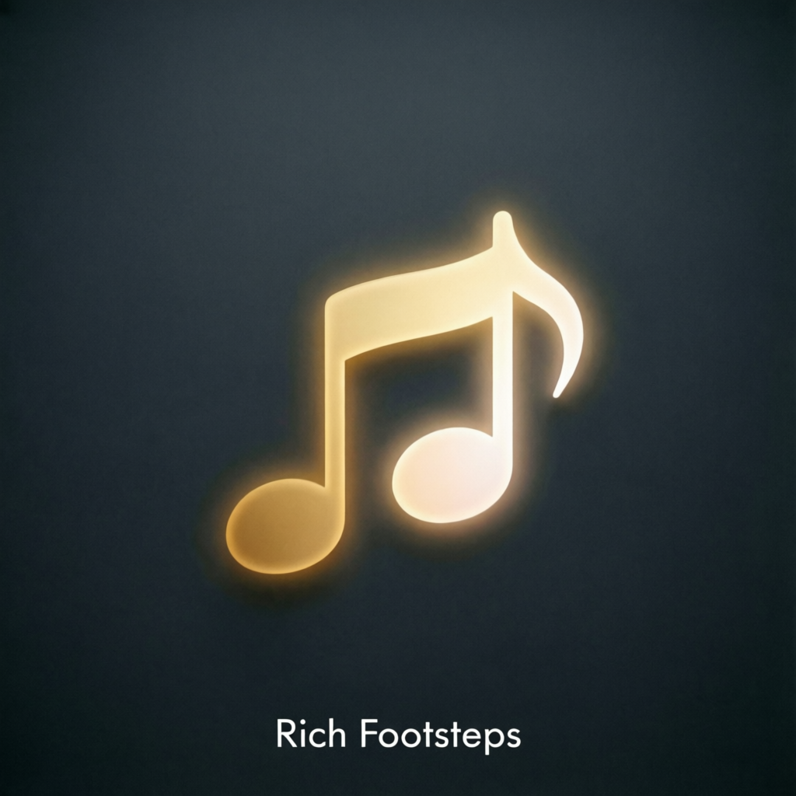

<p align="center">
  
</p>

<h1 align="center">Rich Footsteps Luanti Mod</h1>

<p align="center">
  Rich positional footstep sounds for Mineclonia, VoxeLibre, Minetest Game,
  and compatible Luanti games.
</p>

<p align="center">
  
  
  
  
  
</p>

Rich Footsteps adds richer positional footstep audio while keeping normal
survival gameplay conservative by default. It covers walking, running,
stairs/slabs, climbing, jumping, landing, swimming, foliage brush sounds,
wet/liquid layers, footwear layers, biome variance, substrate-aware
blockmap/primitive fallback, and material-based sound variation. Normal walking
is tuned to a vanilla-like cadence of roughly two steps per second.

This is an unofficial Luanti port/reimplementation. It is not affiliated with,
endorsed by, or maintained by the original Presence Footsteps authors. It is
inspired by the MIT-licensed Presence Footsteps 1.13.0+26.1 baseline. No assets,
data, or code from Presence Footsteps 1.13.2+26.1 or later are used.

## Table of Contents

1. [Compatibility](#compatibility)
2. [Settings](#settings)
3. [Manual Test Matrix](#manual-test-matrix)
4. [API](#api)
5. [ContentDB Checklist](#contentdb-checklist)
6. [Credits And Licensing](#credits-and-licensing)

## Compatibility

- Luanti 5.15.2 target. ContentDB metadata uses `min_minetest_version = 5.15`.
- Mineclonia (`mineclonia`)
- VoxeLibre (`mineclone2`)
- Minetest Game (`minetest_game`) and ordinary Luanti games that use compatible
  node groups or default node sound definitions

The mod has no hard dependencies. It detects registered nodes at startup and
maps them through explicit Mineclonia/VoxeLibre/Minetest Game names, upstream
blockmap substrates, primitive data, groups, node sound names, liquid/climbable
rules, and conservative name fallbacks. Substrate handling covers default, wet,
carpet/thin layers, fence-sized surfaces, foliage, and messy-ground markers.
When Sound Physics is present, `jump` and `land` events use its unprocessed
playback API. Ordinary walk/run/wander sounds keep their normal positional path,
while takeoff and landing cannot receive an extra reflection.
For faster startup, built-in footstep muting is eager only for exact known game
node mappings by default; broad inferred fallbacks still resolve for custom
playback without forcing thousands of item overrides during load.

## Settings

- `presence_footsteps_enabled`: enable or disable this mod.
- `presence_footsteps_gain`: global volume multiplier.
- `presence_footsteps_max_hear_distance`: positional sound range.
- `presence_footsteps_replace_builtin`: mute built-in footsteps on known mapped
  nodes, reducing doubled sounds.
- `presence_footsteps_replace_inferred_builtin`: also mute built-in footsteps
  on inferred group/name fallback and blockmap nodes, so mapped surfaces do not
  double with the game's default step sounds. Enabled by default.
- `presence_footsteps_stand_sounds`: rare stationary sounds, disabled by
  default.
- `presence_footsteps_foliage`: occasional brush sounds while entering or
  moving through plants, crops, vines, and similar foliage.
- `presence_footsteps_foliage_gain`: foliage brush volume multiplier.
- `presence_footsteps_wet_surfaces`: add a subtle wet layer during rain/thunder
  on outdoor surfaces when `mcl_weather` is available.
- `presence_footsteps_wet_gain`: wet layer volume multiplier.
- `presence_footsteps_footwear`: add boot material layers from Mineclonia /
  VoxeLibre armor slots.
- `presence_footsteps_player_gain`: gain for the local player's own footsteps.
- `presence_footsteps_other_player_gain`: gain for other players' footsteps.
- `presence_footsteps_entities`: experimental non-player entity footsteps,
  disabled by default.
- `presence_footsteps_max_entities`: limit for experimental entity footsteps.
- `presence_footsteps_entity_targets`: entity target policy: `all`,
  `players_and_hostiles`, or `players_only`.
- `presence_footsteps_ignored_entities`: comma-separated Lua entity names to
  skip in addition to the built-in flying/projectile/noisy ignore list.
- `presence_footsteps_passive_entity_gain`: gain for passive entity footsteps.
- `presence_footsteps_hostile_entity_gain`: gain for hostile entity footsteps.
- `presence_footsteps_object_gain`: gain for object/vehicle-like sounds such
  as boats, minecarts, armor stands, and shulker-like entities when detected.
- `presence_footsteps_winged_players`: allow API-controlled winged player
  locomotion. Disabled by default because Luanti/Mineclonia do not expose a
  reliable Mine Little Pony-style stance.
- `presence_footsteps_debug`: write resolver/debug messages to the log.

When debug mode is enabled, two chat commands are available:

- `/presence_footsteps_node`: prints feet/below/surface nodes, resolver source,
  acoustic key, foliage/footwear/wet/biome state, tracker state, and whether the
  built-in footstep was muted.
- `/presence_footsteps_audit`: prints mapped/unmapped walkable node counts and
  logs examples of unmapped nodes, including counts for common acoustic keys.
- `/presence_footsteps_trace`: prints recent tracker events for the current
  player, such as `step`, `takeoff`, `airborne_confirmed`, `land`,
  `cancel_takeoff`, `skip_step_suppressed`, `surface_clamp`, `wing_state`, and
  quadruped/winged locomotion details.
- `/presence_footsteps_entity_audit`: prints tracked/ignored entity counts by
  object/passive/hostile category and example entity names.

## Manual Test Matrix

- Walk for 10 seconds on grass, wood, and stone; expect roughly 20 step events,
  not rapid 4-per-second walking.
- Sprint for 10 seconds; expect a faster cadence without burst playback.
- Hold sprint while hunger or another mechanic prevents real speed increase;
  cadence should remain walking cadence and debug should show `running=no`.
- Fall onto mapped blocks such as stone, grass, dirt, wood, gravel, and path;
  landing should play as one compact event, not a stacked duplicate.
- Test jump and landing on mapped nodes; each action should play once.
- Walk up and down stairs/slabs; expect `up`/`down`-style events without doubled
  ordinary steps.
- Stop or sharply change direction while walking; `wander` may play rarely, not
  on every turn.
- With `presence_footsteps_stand_sounds = true`, stand still for a while and
  confirm rare quiet stationary sounds.
- Jump in place 20 times on grass, wood, stone, and path blocks; jump/landing
  events should be consistent and should not only happen rarely.
- Run while holding jump for at least 20 jumps; land events should play every
  real landing, not only every several jumps.
- Walk into a block so Luanti steps the player upward, then hold forward+jump;
  repeated land events should continue while jump remains held.
- Walk forward while repeatedly jumping; ordinary walk/run steps should not
  stack on top of jump or landing events.
- Walk between path/farmland and normal blocks in both directions; there should
  be no doubled step when crossing the surface boundary.
- Test grass, dirt, stone, cobble, deepslate, sand, sandstone, gravel, snow,
  ice, glass, wool/carpet, wood, metal blocks, ores, mud, clay, nether blocks,
  rails/chains, water, and lava edges in Mineclonia and VoxeLibre.
- In Minetest Game, test default stone/cobble, dirt/grass, sand/sandstone,
  gravel, snow/ice, glass/xpanes, wool/beds, wood/stairs/slabs, ores/metal
  blocks, ladders, water, and lava edges.
- With `presence_footsteps_replace_builtin = true`, mapped nodes should not
  produce doubled built-in footsteps.
- With default startup settings, exact Mineclonia/VoxeLibre/Minetest Game nodes
  should be muted while broad inferred third-party nodes should not cause long
  startup delays.
- Use `/presence_footsteps_trace` after sprinting and landing; sprint steps
  should show `step run speed=...` only when actual speed is high enough, and
  landings should show `land:single_layer`.
- In multiplayer, nearby players should be audible positionally, with no server
  log spam while debug mode is disabled.
- Move through tall grass, flowers, crops, vines, leaves, and coral-like plants;
  foliage brush sounds should be occasional, roughly tied to entry/distance
  through foliage, without rapid repeated spam.
- During rain/thunder, outdoor mapped surfaces should get a subtle wet layer;
  caves and non-rain biomes should stay dry.
- Walk on carpets, panes/thin layers, fences/walls, stairs/slabs, and blocks
  next to narrow collision boxes; carpets/thin walkable layers should use their
  own top sound, while fence-like nodes should not become false floor sounds.
- Test substrate cases from upstream blockmap: wet surfaces should prefer wet
  substrate acoustics, carpet/thin layers should prefer carpet substrate
  acoustics, and messy foliage should use brush/foliage acoustics without spam.
- Test leather, chain, iron, gold, diamond, copper, and netherite boots; boot
  layers should be audible while the surface layer is reduced.
- If `presence_footsteps_entities = true`, nearby `mobs_mc` bipeds/quadrupeds
  should produce conservative positional footsteps within the entity limit.
- If entity sounds are enabled, test boats, minecarts, armor stands, and
  shulker-like objects; they should use object gain and golem/object acoustics
  rather than ordinary mob surface guesses.
- With `presence_footsteps_winged_players = true`, call
  `presence_footsteps.set_player_locomotion(name, "winged")` from another mod
  or console helper; airborne movement should use quiet wing/swift layers and
  trace `wing_state`.
- Call `presence_footsteps.set_player_locomotion(name, "quadruped")`; walking
  should use paired hoof-like steps without reverting to the old too-fast
  ordinary cadence.

## API

```lua
presence_footsteps.register_node_sound("mcl_core:stone", "stone")
presence_footsteps.register_group_rule({
  any_group = { "custom_group" },
  acoustic = "wood",
})
presence_footsteps.play_step(player, "stone", "walk")
presence_footsteps.register_foliage_sound("mcl_flowers:tallgrass", "brush")
presence_footsteps.register_footwear_sound("mcl_armor:boots_iron", "metalboots")
presence_footsteps.register_entity_locomotion("mobs_mc:zombie", "biped")
presence_footsteps.register_object_sound("mcl_minecarts:minecart", "metalbar")
presence_footsteps.set_player_locomotion("singleplayer", "winged")
presence_footsteps.set_player_locomotion("singleplayer", "quadruped")
```

Acoustic keys are the original Presence Footsteps material names, for example
`stone`, `dirt`, `grass`, `wood`, `sand`, `gravel`, `glass`, `rug`, `snow`,
`hardmetal`, `waterfine`, `brush`, `boots`, `metalboots`, and `swim_water`.

## ContentDB Checklist

- Package metadata is in English and marks the project as an unofficial port.
- `.cdb.json` uses `license = "LGPL-3.0-or-later"`,
  `media_license = "MIT"`, and `ai_disclosure = "ASSISTED"`.
- `LICENSE` describes the mixed-license package and preserves the upstream MIT
  copyright notice.
- `THIRD_PARTY_NOTICES.md` lists upstream source, authors, media, generated
  data, and AI assistance.
- `screenshots/cover.png` is included as the ContentDB screenshot/cover image.

## Credits And Licensing

Original Presence Footsteps by Hurricaaane (Ha3), continued by Sollace and Mine
Little Pony contributors. Rich Footsteps is an unofficial Luanti
port/reimplementation inspired by the MIT-licensed Presence Footsteps
1.13.0+26.1 baseline and is not endorsed by the original authors.

The bundled sound assets and converted configuration data come from the local
Presence-Footsteps-1.13.0-26.1 source package included with this project. No
assets, data, or code from Presence Footsteps 1.13.2+26.1 or later are used. The
original Java/Fabric code is used as a reference and is not shipped as
executable Luanti code.

Luanti cannot exactly reproduce Minecraft client mixins, Mine Little Pony stance
auto-detection, or Minecraft's per-foot voxel collision solver. This port uses
explicit API calls, settings, and Luanti node/object APIs for those cases.

| Package part | License | Notes |
| --- | --- | --- |
| New Luanti port code | LGPL-3.0-or-later | Weak copyleft: games/modpacks may use the mod, while modifications to LGPL-covered port code should stay free. |
| Port-owned docs/metadata | LGPL-3.0-or-later | Includes README/package metadata written for this Luanti port. |
| Bundled upstream sound assets | MIT | Converted/renamed from upstream mono OGG assets; upstream copyright notice is preserved. |
| Upstream-derived generated data | MIT notice preserved | Lua data generated/converted from upstream JSON/resource-pack configuration; Luanti glue around it is LGPL. |

See `LICENSE` and `THIRD_PARTY_NOTICES.md` for the full package licensing
summary and third-party attribution. AI assistance was used for code,
documentation, and packaging work; no bundled sound assets were generated by AI.
